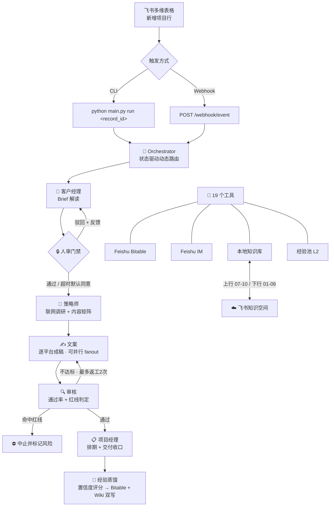

<div align="center">

<br/>


# 多 Agent 内容营销流水线

<p align="center">
  <strong>以飞书多维表格为事实源，6 个 AI 角色组建虚拟营销团队</strong><br/>
  <code>Brief 一键触发</code> → <code>全链路自动化</code> → <code>经验自沉淀</code>
</p>

<br/>

<p>
  
  
  
  
  
</p>

<p>
  
  
  
  
  
</p>

<br/>

</div>

---

<details open>
<summary><h2>📑 目录</h2></summary>

- [一句话定位](#-一句话定位)
- [解决什么问题](#-解决什么问题)
- [六大 Agent 角色](#-六大-agent-角色)
- [主链路架构](#-主链路架构)
- [能力全景](#-能力全景)
- [项目结构](#-项目结构)
- [三层记忆系统](#-三层记忆系统)
- [知识库分层](#-知识库分层)
- [审核与人审机制](#-审核与人审机制)
- [快速开始](#-快速开始)
- [运维脚本速查](#-运维脚本速查)
- [技术栈](#-技术栈)
- [设计原则](#-设计原则)
- [建议阅读顺序](#-建议阅读顺序)

</details>

---

## 💡 一句话定位

> 客户在飞书多维表格新建一行 Brief，系统自动完成：
>
> **Brief 解读 → 人审门禁 → 联网调研策略 → 平台化文案 → 红线审核 + 返工 → 排期交付 → 经验蒸馏 → 知识沉淀**

不是"AI 写一篇稿"，而是一条 **可执行、可追踪、可治理、可沉淀** 的完整业务链。

---

## 🎯 解决什么问题

<table>
<tr>
<th width="30%">😩 传统方式</th>
<th width="35%">🚀 智组织方案</th>
<th width="35%">🤖 AI 关键作用</th>
</tr>
<tr>
<td>一个营销项目需 5+ 人协作，沟通成本高</td>
<td>6 个 AI Agent 自动协作，一行 Brief 触发全流程</td>
<td>角色化分工 + 状态驱动编排</td>
</tr>
<tr>
<td>Brief→策略→文案→审核→交付，人工串行 <strong>5-10 天</strong></td>
<td>AI 全链路并行执行，<strong>分钟级</strong>完成</td>
<td>ReAct 推理 + 工具调用</td>
</tr>
<tr>
<td>经验留在个人脑中，人员流动即失</td>
<td>自动蒸馏→打分→去重→沉淀，越跑越聪明</td>
<td>经验 Hook + 置信度评估 + 双写</td>
</tr>
<tr>
<td>内容质量依赖人工审核，标准不统一</td>
<td>五维结构化审核 + 红线一票否决 + 自动返工</td>
<td>规则检索 + 合规判定</td>
</tr>
<tr>
<td>交付物散落在聊天/文档中</td>
<td>自动生成飞书交付文档（含图表、排期表）</td>
<td>文档结构化生成 + 图表渲染</td>
</tr>
<tr>
<td>运营数据靠人工汇总</td>
<td>数据分析师跨项目自动出周报/洞察/决策</td>
<td>三表聚合 + 报告生成 + 群聊推送</td>
</tr>
</table>

> **💎 核心价值**：将 5 人团队 5-10 天的工作压缩到 AI 分钟级完成，同时保留人类决策权（人审门禁）和质量底线（红线审核）。

---

## 🎭 六大 Agent 角色

```
┌────────────────────── 项目流水线（Orchestrator 状态驱动编排）──────────────────────┐
│                                                                                  │
│   👔 客户经理    →   🧠 策略师    →   ✍️ 文案     →   🔍 审核   →   📋 项目经理  │
│   Brief 解读        联网调研         逐平台成稿      通过率+红线     排期+交付收口 │
│        │                                  ↑              │                       │
│        ▼                                  └──── 返工 ────┘                       │
│   🔒 人审门禁                                                                    │
│                                                                                  │
└──────────────────────────────────────────────────────────────────────────────────┘

┌───────────── 独立 Agent ─────────────┐
│   📊 数据分析师  data_analyst         │
│   跨项目统计 → 运营周报/洞察/决策     │
└──────────────────────────────────────┘
```

> 每个角色由 `agents/{role_id}/soul.md` 定义人格与工具白名单
> **新增角色 = 新建目录 + soul.md，零代码改动**

---

## 🔄 主链路架构



---

## ✅ 能力全景

<table>
<tr><th>模块</th><th>说明</th><th>关键文件</th></tr>
<tr><td>🔀 <strong>状态驱动动态路由</strong></td><td>从任意中间状态恢复，路由表可配置</td><td><code>orchestrator.py</code></td></tr>
<tr><td>🔌 <strong>双入口触发</strong></td><td>CLI + FastAPI Webhook</td><td><code>main.py</code></td></tr>
<tr><td>📝 <strong>结构化审核</strong></td><td>通过率 / 红线 / 状态 / 总评四字段</td><td><code>agents/reviewer/soul.md</code></td></tr>
<tr><td>🔒 <strong>人审门禁</strong></td><td>飞书卡片审批，超时可默认同意</td><td><code>orchestrator.py</code></td></tr>
<tr><td>🔄 <strong>审核返工循环</strong></td><td>不达标自动回退文案，最多 2 次</td><td><code>orchestrator.py</code></td></tr>
<tr><td>⚡ <strong>文案并行 fanout</strong></td><td>按平台并行生成，信号量控制并发</td><td><code>orchestrator.py</code></td></tr>
<tr><td>🎯 <strong>平台专属补丁</strong></td><td>copywriter 按目标平台动态注入 soul 补丁</td><td><code>agents/copywriter/platforms/</code></td></tr>
<tr><td>🔥 <strong>文案双轨工作流</strong></td><td>爆款对标 + 合规自检</td><td><code>tools/search_reference.py</code></td></tr>
<tr><td>🌐 <strong>策略师联网调研</strong></td><td>Tavily 搜索 + trafilatura 网页抓取</td><td><code>tools/search_web.py</code></td></tr>
<tr><td>🧠 <strong>三层记忆系统</strong></td><td>L0 工作记忆 + L1 项目记忆 + L2 经验池</td><td><code>memory/</code></td></tr>
<tr><td>🧬 <strong>经验蒸馏 + 溯源</strong></td><td>Hook 自省产出经验，携带完整溯源链</td><td><code>memory/experience.py</code></td></tr>
<tr><td>📚 <strong>知识分层治理</strong></td><td>11 层目录 + 双向白名单同步</td><td><code>knowledge/</code>, <code>sync/</code></td></tr>
<tr><td>⬆️ <strong>经验升格审批</strong></td><td>11→10 必须过飞书审批表</td><td><code>scripts/submit_inbox_to_review.py</code></td></tr>
<tr><td>📊 <strong>跨项目数据分析</strong></td><td>数据分析师自动生成运营报告</td><td><code>tools/query_project_stats.py</code></td></tr>
<tr><td>📺 <strong>实时 Dashboard</strong></td><td>SSE 事件流 + React 实时面板</td><td><code>dashboard/</code></td></tr>
<tr><td>📈 <strong>经验进化可视化</strong></td><td>漏斗摘要 + 卡片详情 + 置信度进度条</td><td><code>ExperienceEvolution.tsx</code></td></tr>
</table>

---

## 🏗️ 项目结构

```text
feishu-multi-agent/
│
├── agents/                          # 🎭 角色定义
│   ├── _shared/                     #    公司级共享知识
│   ├── account_manager/soul.md      #    👔 客户经理
│   ├── strategist/soul.md           #    🧠 策略师
│   ├── copywriter/                  #    ✍️ 文案
│   │   ├── soul.md
│   │   └── platforms/               #    平台专属补丁（公众号/小红书/抖音）
│   ├── reviewer/soul.md             #    🔍 审核
│   ├── project_manager/soul.md      #    📋 项目经理
│   ├── data_analyst/soul.md         #    📊 数据分析师
│   ├── contracts/                   #    角色间协作契约（JSON Schema）
│   └── base.py                      #    唯一 Agent 引擎（ReAct + function calling）
│
├── tools/                           # 🔧 19 个工具（Agent 可调用）
│   ├── read_project.py              #    项目主表读取
│   ├── write_project.py             #    项目主表写入
│   ├── search_web.py                #    联网搜索（Tavily）
│   ├── query_project_stats.py       #    跨项目统计
│   └── ...                          #    更多见 tools/__init__.py
│
├── memory/                          # 🧠 三层记忆
│   ├── working.py                   #    L0 工作记忆（token 窗口管理）
│   ├── project.py                   #    L1 项目记忆（Bitable 行映射）
│   └── experience.py                #    L2 经验池（Bitable + Wiki 双写）
│
├── feishu/                          # 📡 飞书 API 封装（直调 OpenAPI）
│   ├── auth.py                      #    TokenManager 单例
│   ├── bitable.py                   #    多维表 CRUD（全局并发闸门）
│   ├── im.py                        #    消息 + 人审卡片
│   └── wiki.py                      #    知识空间节点读写
│
├── knowledge/                       # 📚 本地知识库（11 层 + references）
├── sync/                            # 🔄 飞书知识空间双向同步
├── dashboard/                       # 📊 实时 Dashboard（React 19 + SSE）
│   ├── event_bus.py                 #    SSE 事件总线
│   ├── react-app/                   #    前端源码
│   └── static/                      #    构建产物（FastAPI 挂载）
│
├── scripts/                         # 🛠️ 运维脚本
├── tests/                           # 🧪 100 测试用例
├── docs/                            # 📄 架构文档 + 验收标准
├── demo/                            # 🎬 Demo 脚本 + 样例 Brief
│
├── config.py                        # ⚙️ 配置中心
├── orchestrator.py                  # 🎯 总编排器
├── main.py                          # 🚀 入口（CLI run/sync/serve/report）
└── requirements.txt
```

---

## 🧠 三层记忆系统

```
┌─────────────────────────────────────────────────────────────────────────────┐
│                           记忆层级架构                                       │
├─────────┬──────────────────────┬──────────┬─────────────────────────────────┤
│  层级   │ 存储位置              │ 生命周期 │ 作用                             │
├─────────┼──────────────────────┼──────────┼─────────────────────────────────┤
│  L0     │ memory/working.py    │ 单次会话 │ prompt + messages，token 裁剪   │
│  L1     │ Bitable 项目主表     │ 单项目   │ 多角色共享事实源                  │
│  L2     │ Bitable + 本地 Wiki  │ 跨项目   │ 蒸馏→打分→双写→溯源             │
└─────────┴──────────────────────┴──────────┴─────────────────────────────────┘
```

| 层级 | 存储 | 生命周期 | 核心机制 |
|:---:|:---|:---:|:---|
| **L0** | `memory/working.py` | 单次会话 | prompt + messages + 工具上下文，按 token 整组裁剪，任务结束销毁 |
| **L1** | Bitable 项目主表 + 内容表 | 单项目 | 多角色共享事实源，通过读写同一行记录协作 |
| **L2** | Bitable 经验池表 + 本地 Wiki | 跨项目持久 | Hook 蒸馏 → 置信度评分 → Bitable + Wiki 双写，溯源到 project/run/stage |

---

## 📚 知识库分层

```text
knowledge/
├── 01_企业底座/           ┐
├── 02_服务方法论/         │  📖 人类维护层
├── 03_行业知识/           │  源真值在飞书
├── 04_平台打法/           │  ⬇️ 只下行（wiki_download）
├── 05_标准模板/           │
├── 06_客户档案/           ┘
├── 07_项目档案/           ┐
├── 08_项目执行记录/       │  🤖 Agent 产出层
├── 09_项目复盘/           │  源真值在本地
├── 10_经验沉淀/           ┘  ⬆️ 只上行（wiki_sync 白名单）
├── 11_待整理收件箱/       ← 🔒 脏缓冲，升格需过飞书审批
└── references/            ← 🔥 爆款对标库，仅本地使用
```

**核心约束**：`01–06` 不被 Agent 覆盖 · `07–10` 不被人覆盖 · `11→10` 必须通过飞书「升格审批表」

> 📖 详细设计 → [`docs/knowledge-architecture.md`](docs/knowledge-architecture.md)

---

## 🔍 审核与人审机制

### Reviewer 产出四字段

| 字段 | 类型 | 说明 |
|:---|:---:|:---|
| `review_pass_rate` | `float` | 通过率（0–1） |
| `review_red_flag` | `string` | 红线标记（严重合规风险 / 虚假宣传 / 绝对化用语 / 医疗化表述 / 编造数据 / 事实错误） |
| `review_status` | `enum` | 通过 / 需修改 / 待人审 / 超时 |
| `review_summary` | `text` | 文本总评 |

### Orchestrator 决策矩阵

| 情形 | 动作 |
|:---|:---|
| `pass_rate ≥ 阈值` 且无红线 | ✅ 进入项目经理排期 |
| 命中红线关键词 | ⛔ 中止并标记风险 |
| `pass_rate < 阈值` | 🔄 回退文案返工（最多 2 次） |
| 达到重试上限仍未通过 | ❌ 状态置「已驳回」 |

> 阈值按项目类型细分：母婴 `0.8` / 医疗健康 `0.9`，见 `config.py:REVIEW_THRESHOLDS_BY_PROJECT_TYPE`

### 人审门禁（客户经理 → 策略师之间）

```
飞书交互卡片 → 轮询群消息 → 识别操作 → 流转/回退
```

1. 发飞书交互卡片到群聊
2. 轮询群消息，识别「通过」/「修改：xxx」/ 超时
3. 超时默认同意（`AUTO_APPROVE_HUMAN_REVIEW=true` 为 Demo 快跑模式）
4. 驳回时回退到「解读中」，反馈写入「人类修改意见」字段

---

## 🚀 快速开始

### 1️⃣ 安装依赖

```bash
pip install -r requirements.txt
```

### 2️⃣ 配置环境变量

```bash
cp .env.example .env
```

<details>
<summary><b>📋 最小必填配置</b></summary>

```env
FEISHU_APP_ID=cli_xxx
FEISHU_APP_SECRET=xxx
BITABLE_APP_TOKEN=app_xxx
PROJECT_TABLE_ID=tbl_xxx
CONTENT_TABLE_ID=tbl_xxx
EXPERIENCE_TABLE_ID=tbl_xxx
LLM_API_KEY=sk-xxx
LLM_MODEL=gpt-4o
```

</details>

<details>
<summary><b>🔧 常用可选配置</b></summary>

```env
FEISHU_CHAT_ID=oc_xxx              # IM 广播 & 人审卡片目标群
WIKI_SPACE_ID=xxx                  # 启用知识空间同步
TAVILY_API_KEY=tvly-xxx            # 启用策略师联网调研
WEBHOOK_VERIFICATION_TOKEN=xxx     # 飞书事件订阅校验
AUTO_APPROVE_HUMAN_REVIEW=false    # Demo 快跑模式设 true
```

</details>

### 3️⃣ 初始化知识库（首次）

```bash
python scripts/init_wiki_tree.py
```

### 4️⃣ 运行项目

```bash
# 单项目执行
python main.py run <record_id>

# Demo 模式（含样例 Brief）
python demo/run_demo.py --scene 电商大促
```

### 5️⃣ 启动服务 + Dashboard

```bash
python main.py serve
# 访问 http://localhost:8000/static/index.html
```

<details>
<summary><b>🔗 飞书事件订阅配置</b></summary>

| 项目 | 值 |
|:---|:---|
| **请求地址** | `http(s)://<host>:8000/webhook/event` |
| **订阅事件** | `bitable.record.created_v1` |
| **所需权限** | 多维表格读写 + 知识空间写入 + IM 发消息 |

</details>

### 6️⃣ 数据分析报告

```bash
python main.py report                      # 运营周报
python main.py report --type insight        # 数据洞察
python main.py report --type decision       # 决策建议
```

### 7️⃣ 知识同步

```bash
python main.py sync --direction up          # 本地 07-10 → 飞书
python main.py sync --direction down        # 飞书 01-06 → 本地
python main.py sync --direction both
```

---

## 🛠️ 运维脚本速查

| 脚本 | 用途 |
|:---|:---|
| `init_wiki_tree.py` | 初始化 `knowledge/` 11 层目录树 |
| `audit_wiki_local.py` | 审计本地 wiki（frontmatter / HTML 注释 / NUL 字符） |
| `preview_wiki_sync.py` | 预览将要同步的文件清单（dry-run） |
| `reset_dirty_sync.py` | 重置 `.sync_state.json` 脏标记 |
| `submit_inbox_to_review.py` | 提交 11 目录候选条目到升格审批表 |
| `apply_approved_promotions.py` | 应用通过的升格审批，移入 10 对应分类 |
| `dedupe_wiki.py` | 知识库去重合并 |
| `check_demo_ready.py` | 检查 Demo 环境就绪度 |

---

## ⚙️ 技术栈

<table>
<tr><th>层级</th><th>选型</th></tr>
<tr><td><strong>语言</strong></td><td>Python 3.11+，async/await 全异步</td></tr>
<tr><td><strong>LLM</strong></td><td>OpenAI SDK（兼容任意 OpenAI 协议端点，通过 <code>LLM_BASE_URL</code> 配置）</td></tr>
<tr><td><strong>Web 框架</strong></td><td>FastAPI + uvicorn</td></tr>
<tr><td><strong>HTTP 客户端</strong></td><td>httpx</td></tr>
<tr><td><strong>网页抓取</strong></td><td>trafilatura</td></tr>
<tr><td><strong>图表</strong></td><td>matplotlib（Agg 后端，内存渲染）</td></tr>
<tr><td><strong>测试</strong></td><td>pytest + pytest-asyncio（100 测试用例）</td></tr>
<tr><td><strong>前端</strong></td><td>React 19 + TypeScript + Vite 8 + Tailwind 4 + Zustand + framer-motion</td></tr>
<tr><td><strong>飞书集成</strong></td><td>直调 OpenAPI（不依赖官方 SDK）</td></tr>
<tr><td><strong>Agent 引擎</strong></td><td><strong>自研 ReAct 循环 + function calling</strong>（不依赖任何 Agent 框架）</td></tr>
<tr><td><strong>知识检索</strong></td><td>本地 <code>.md</code> + 多关键词 grep（毫秒级，不用向量库）</td></tr>
</table>

---

## 🎯 设计原则

| 原则 | 说明 |
|:---|:---|
| **配置驱动，零代码扩展** | 新增角色 = 新建 `soul.md`，声明工具白名单即可 |
| **飞书即事实源** | Bitable 行记录是共享黑板，多角色读写同一行协作，无内部 RPC |
| **本地优先 + 后台同步** | Agent 检索走本地 grep（毫秒级），后台异步推送飞书知识空间 |
| **单向同步 + 白名单** | 人类层与 Agent 层严格隔离，升格必须过审 |
| **经验可溯源** | 每条 L2 经验携带 `project_id / run_id / stage / review_status` |
| **状态驱动路由** | 从任意中间状态恢复，路由表可配置，防死循环 |

---

## 📖 建议阅读顺序

| # | 文件 | 要点 |
|:---:|:---|:---|
| 1 | 📍 `README.md` | 全景视图（你在这里） |
| 2 | `orchestrator.py` | 编排主循环、动态路由、人审门禁、经验沉淀 |
| 3 | `agents/base.py` | Agent 引擎、prompt 装配、ReAct 循环 |
| 4 | `agents/*/soul.md` | 角色人格 + 工具白名单 |
| 5 | `memory/project.py` + `experience.py` | L1 / L2 记忆如何落到 Bitable |
| 6 | `config.py` | 字段映射、阈值、路由表、开关 |
| 7 | `sync/wiki_sync.py` | 上行同步白名单逻辑 |
| 8 | `docs/knowledge-architecture.md` | 知识分层完整设计 |
| 9 | `docs/module1_module2_combo.md` | 文案双轨工作流 |
| 10 | `CLAUDE.md` | 开发规范 + 架构细节速查 |

---

<div align="center">

<br/>

> **这不是 AI 写文案，这是把一条真实内容营销业务链**
> **做成可执行、可追踪、可治理、可沉淀的系统。**

<br/>

<sub>Built with ❤️ by 智策传媒虚拟团队</sub>

</div>
