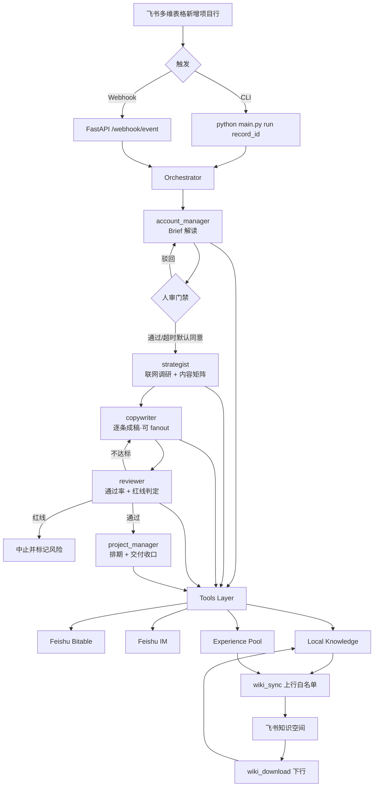

# 飞书·智组织 — 多 Agent 内容生产系统

> 以飞书多维表格为事实源，把「客户经理 → 策略师 → 文案 → 审核 → 项目经理」五个角色串成一条可追踪、可治理、可沉淀的数字内容团队流水线。

<p align="center">
  
  
  
  
  
</p>

---

## 一句话定位

客户在飞书多维表格里新建一行 Brief，系统自动组建虚拟营销团队，**5–10 分钟**完成：Brief 解读 → 人审门禁 → 内容策略（含联网调研）→ 平台化文案（对标爆款 + 合规自检）→ 结构化审核（带红线拦截 + 返工）→ 排期交付 → 经验蒸馏 → 知识空间沉淀。

不是"AI 写一篇稿"，而是一条完整的、可复盘的业务链条。

---

## 当前能力清单（2026-04-19）

| 能力 | 关键文件 | 状态 |
|---|---|---|
| 五角色串行编排 | `orchestrator.py` | ✅ |
| CLI + FastAPI Webhook 双入口 | `main.py` | ✅ |
| 结构化审核（通过率 / 红线 / 状态三字段） | `agents/reviewer/soul.md`, `config.py:REVIEW_*` | ✅ |
| 人审门禁 + 超时默认同意 | `orchestrator.py:_enter_human_review_gate` | ✅ |
| 审核返工循环（最多 2 次） | `orchestrator.py:_handle_reviewer_retries` | ✅ |
| 文案 fanout 并行 | `tests/test_copywriter_fanout.py` | ✅ |
| 文案双轨工作流（爆款对标 + 合规自检） | `tools/search_reference.py`, `docs/module1_module2_combo.md` | ✅ |
| 策略师联网调研（Tavily + web_fetch） | `tools/search_web.py`, `tools/web_fetch.py` | ✅ |
| 知识分层治理（11 个顶级目录） | `knowledge/`, `scripts/init_wiki_tree.py` | ✅ |
| 知识上行同步白名单（仅 07-10） | `sync/wiki_sync.py` | ✅ |
| 知识下行同步（仅 01-06 人类维护层） | `sync/wiki_download.py` | ✅ |
| 经验升格审批（11 → 10 要过审） | `scripts/submit_inbox_to_review.py`, `scripts/apply_approved_promotions.py` | ✅ |
| 经验可溯源（project/run/stage/review） | `memory/experience.py` | ✅ |
| Dashboard 实时投影（SSE + Markdown） | `dashboard/react-app/`, `dashboard/event_bus.py` | ✅ |
| Router / Planner 决策层 | — | 规划中 |

---

## 主链路



---

## 项目结构

```text
feishus/
├── agents/                         # 角色定义（soul.md）+ 共享提示
│   ├── _shared/                    # 公司级共享知识
│   ├── account_manager/soul.md
│   ├── strategist/soul.md
│   ├── copywriter/
│   │   ├── soul.md
│   │   └── platforms/              # 平台补丁：公众号 / 小红书 / 抖音
│   ├── reviewer/soul.md
│   ├── project_manager/soul.md
│   └── base.py                     # 唯一 Agent 引擎（prompt 装配 + ReAct + 工具分发）
├── tools/                          # 17 个工具，Agent 可调
├── memory/
│   ├── project.py                  # L1 项目记忆（Bitable 行映射）
│   ├── experience.py               # L2 经验池（Bitable + 本地 wiki 双写）
│   └── working.py                  # L0 工作记忆窗口（token 估算 + 整组裁剪）
├── feishu/
│   ├── auth.py                     # TokenManager
│   ├── bitable.py                  # 多维表 CRUD（全局并发闸门）
│   ├── im.py                       # 消息与人审卡片
│   └── wiki.py                     # 知识空间节点读写（重试 + 锁竞争处理）
├── knowledge/                      # 本地知识库，详见下节
│   └── references/                 # 爆款对标库（search_reference 专用）
├── sync/
│   ├── wiki_sync.py                # 上行：本地 07-10 → 飞书
│   └── wiki_download.py            # 下行：飞书 01-06 → 本地
├── dashboard/
│   ├── event_bus.py                # SSE 事件总线
│   ├── react-app/                  # React 19 + Vite 8 + Tailwind 4
│   └── static/                     # 构建产物（由 FastAPI 挂载）
├── scripts/                        # 运维脚本（初始化/审计/迁移/升格）
├── docs/                           # 架构文档 + 验收标准 + Runbook
├── tests/                          # 20+ 测试文件
├── config.py                       # 配置与字段映射
├── main.py                         # CLI（run / sync / serve）+ Webhook
├── orchestrator.py                 # 总编排
└── requirements.txt
```

---

## 三层记忆

| 层 | 存储 | 作用 |
|---|---|---|
| **L0 工作记忆** | `memory/working.py` | 单次会话的 prompt / messages / 工具调用上下文，按 token 窗口整组裁剪 |
| **L1 项目记忆** | Bitable「项目主表」+「内容表」 | 单项目内多角色的共享事实源 |
| **L2 经验池** | Bitable「经验池表」+ 本地 `knowledge/10_经验沉淀/` | 跨项目复用；双写并可溯源到 run/stage |

---

## 知识库分层（2026-04 重构后）

```text
knowledge/
├── 01_企业底座/           # 人类维护，源真值在飞书（下行同步）
├── 02_服务方法论/         # 同上
├── 03_行业知识/           # 同上
├── 04_平台打法/           # 同上
├── 05_标准模板/           # 同上
├── 06_客户档案/           # 同上
├── 07_项目档案/           # Agent 产出，源真值在本地（上行白名单）
├── 08_项目执行记录/       # 同上
├── 09_项目复盘/           # 同上
├── 10_经验沉淀/           # Agent 蒸馏，按场景分类（电商大促 / 新品发布 / …）
├── 11_待整理收件箱/       # Agent 脏缓冲，不外推，需走升格审批进入 10
└── references/            # 爆款对标，仅本地 search_reference 使用
```

同步策略：**01–06 只下行**，**07–10 只上行**（白名单由 `WIKI_SYNC_UPLOAD_DIRS` 控制），**11 + references 不出站**。升格 11 → 10 必须通过飞书的「升格审批表」，由 `scripts/apply_approved_promotions.py` 生效。

详细设计：[`docs/knowledge-architecture.md`](docs/knowledge-architecture.md)

---

## 审核与人审机制

**reviewer 产出三字段**：

- `review_pass_rate` — 通过率（0–1）
- `review_red_flag` — 红线标记（严重合规风险 / 虚假宣传 / 绝对化用语 / 医疗化表述 / 编造数据 / 事实错误 / 严重不适配）
- `review_status` — 结构化状态（通过 / 需修改 / 待人审 / 超时）
- `review_summary` — 文本总评

**Orchestrator 依据字段决策**：

| 情形 | 动作 |
|---|---|
| `pass_rate >= 阈值` 且无红线 | → 进入 PM 排期 |
| 命中红线关键词 | → 中止并标记风险 |
| `pass_rate < 阈值` | → copywriter 返工，最多 `REVIEW_MAX_RETRIES=2` 次 |
| 达到重试上限仍未通过 | → 状态置「已驳回」 |

阈值支持按项目类型细分，母婴 / 医疗健康默认为 0.8 / 0.9，见 `config.py:REVIEW_THRESHOLDS_BY_PROJECT_TYPE`。

**人审门禁**（AM 完成 → 策略师之前）：

- 发飞书卡片 → 轮询群消息 → 检测「通过」/「修改：xxx」/ 超时
- 超时默认同意（由 `AUTO_APPROVE_HUMAN_REVIEW` 控制 Demo 模式下直接跳过）
- 被驳回时回退到「解读中」，反馈落盘到「人类修改意见」字段，下次触发 AM 读取反馈重写

---

## 快速开始

### 1. 安装依赖

```bash
pip install -r requirements.txt
```

前端（可选，仅在需要开发 Dashboard 时）：

```bash
cd dashboard/react-app
npm install
```

### 2. 配置环境变量

```bash
cp .env.example .env
```

**最小必填**：

```env
FEISHU_APP_ID=cli_xxx
FEISHU_APP_SECRET=xxx
BITABLE_APP_TOKEN=app_xxx
PROJECT_TABLE_ID=tbl_xxx
CONTENT_TABLE_ID=tbl_xxx
EXPERIENCE_TABLE_ID=tbl_xxx
LLM_API_KEY=sk-xxx
LLM_MODEL=gpt-4o
```

**常用可选**：

```env
FEISHU_CHAT_ID=oc_xxx              # IM 广播 & 人审卡片目标群
WIKI_SPACE_ID=xxx                  # 启用知识空间同步
TAVILY_API_KEY=tvly-xxx            # 启用策略师联网调研
WEBHOOK_VERIFICATION_TOKEN=xxx     # 飞书事件订阅校验
AUTO_APPROVE_HUMAN_REVIEW=false    # Demo 快跑模式设 true
```

### 3. 初始化知识库目录树（首次运行）

```bash
python scripts/init_wiki_tree.py
```

### 4. 跑一个项目

```bash
python main.py run <record_id>
```

### 5. 启动 Webhook + Dashboard

```bash
python main.py serve
# 访问 http://localhost:8000/static/index.html
```

飞书开放平台事件订阅：

- 请求地址：`http(s)://<host>:8000/webhook/event`
- 订阅事件：`bitable.record.created_v1`
- 权限：多维表格读写 + 知识空间写入 + IM 发消息

### 6. 手动同步知识库

```bash
python main.py sync --direction up     # 本地 07-10 → 飞书
python main.py sync --direction down   # 飞书 01-06 → 本地
python main.py sync --direction both
```

### 7. 前端开发

```bash
cd dashboard/react-app
npm run dev           # 开发模式
npm run build         # 产出到 dashboard/static/
```

---

## 运维脚本速查

| 脚本 | 用途 |
|---|---|
| `init_wiki_tree.py` | 初始化 `knowledge/` 11 层目录树 |
| `audit_wiki_local.py` | 审计本地 wiki：frontmatter / HTML 注释 / NUL 字符 |
| `preview_wiki_sync.py` | 预览将要同步的文件清单（不执行） |
| `sync_local_to_wiki.py` | 手动上行同步（等价 `main.py sync --direction up`） |
| `migrate_wiki_template.py --apply` | 历史模板迁移到新格式 |
| `reset_dirty_sync.py` | 重置 `.sync_state.json` 脏标记 |
| `submit_inbox_to_review.py` | 把 11 目录候选条目提交升格审批表 |
| `apply_approved_promotions.py` | 应用通过的升格审批，把文件移入 10 对应分类 |
| `dedupe_wiki.py` | 知识库去重合并 |
| `check_demo_ready.py` | 检查 Demo 环境就绪度 |
| `selfcheck_orchestrator_red_flag.py` | 诊断红线拦截链路 |

---

## 技术栈

| 层 | 选型 |
|---|---|
| 语言 | Python 3.11+，async/await 全异步 |
| LLM | OpenAI SDK（兼容任意 OpenAI 协议端点，via `LLM_BASE_URL`） |
| Web | FastAPI 0.115+ / uvicorn |
| HTTP | httpx 0.27+ |
| 网页抓取 | trafilatura |
| 测试 | pytest 8 + pytest-asyncio |
| 前端 | React 19 + TypeScript + Vite 8 + Tailwind 4 + Zustand + framer-motion + react-markdown |
| 飞书 | 直调 OpenAPI，不用 SDK |
| Agent | **不用任何 Agent 框架**，`agents/base.py` 手写 ReAct 循环 + function calling |
| 知识检索 | 本地 .md + 多关键词 grep，不用向量库 |

---

## 关键设计原则

- **配置驱动**：新增角色 = 新建 `agents/{role_id}/soul.md` + frontmatter 声明工具白名单，零代码改动。
- **飞书作为事实源**：Bitable 的项目主表和内容表就是共享黑板，五角色通过读写同一行记录协作，无内部 RPC。
- **本地优先 + 后台同步**：Agent 检索直接走本地 `.md` + grep（毫秒级），不请求飞书；后台线程异步把 07-10 推送到飞书知识空间。
- **单向同步 + 白名单**：严格划分「人类维护层」和「Agent 产出层」，绝不互相覆盖；升格必须过审。
- **经验必溯源**：每条 L2 经验携带 `project_id / run_id / stage / review_status`，支持下游质量复检。

---

## 建议阅读顺序（新人接手）

1. `README.md`（你在这里）
2. `orchestrator.py` — 看编排主循环和分支
3. `agents/base.py` — 看 Agent 引擎怎么装配 prompt 和跑 ReAct
4. `agents/*/soul.md` — 感受角色人格和工具白名单
5. `memory/project.py` + `memory/experience.py` — 看 L1 / L2 记忆如何落地
6. `sync/wiki_sync.py` — 看上行同步白名单逻辑
7. `config.py` — 对齐所有字段映射和阈值
8. `docs/knowledge-architecture.md` — 看知识分层的完整设计
9. `docs/module1_module2_combo.md` — 看文案双轨工作流
10. `docs/02_执行流程文档.md` — 看全链路细节

---

## 路线图

**进行中**

- Router / Planner 决策层：根据 Brief 自动选择链路类型（样稿优先 / 完整链路 / 快速模式）
- 项目分型与链路分流
- 更细粒度的异常态治理（网络抖动 / API 超限 / 部分角色失败）

**下一阶段**

- 样稿优先模式（策略师之前插入样稿试跑）
- 经验使用反馈闭环（经验被调用后，其有用度自动更新置信度）
- Dashboard 侧的人审卡片直接操作（目前需要去 IM 回复）

---

## 一句话总结

**这不是 AI 写文案，这是把一条真实内容营销业务链做成可执行、可追踪、可治理、可沉淀的系统。**
