# 飞书·智组织 · 执行流程文档

> 本文档基于 `main.py` / `orchestrator.py` / `agents/base.py` / `dashboard/event_bus.py` / `memory/*` 的实际源码还原系统动态执行流程。

---

## 1. 系统概述

### 1.1 执行流程概览

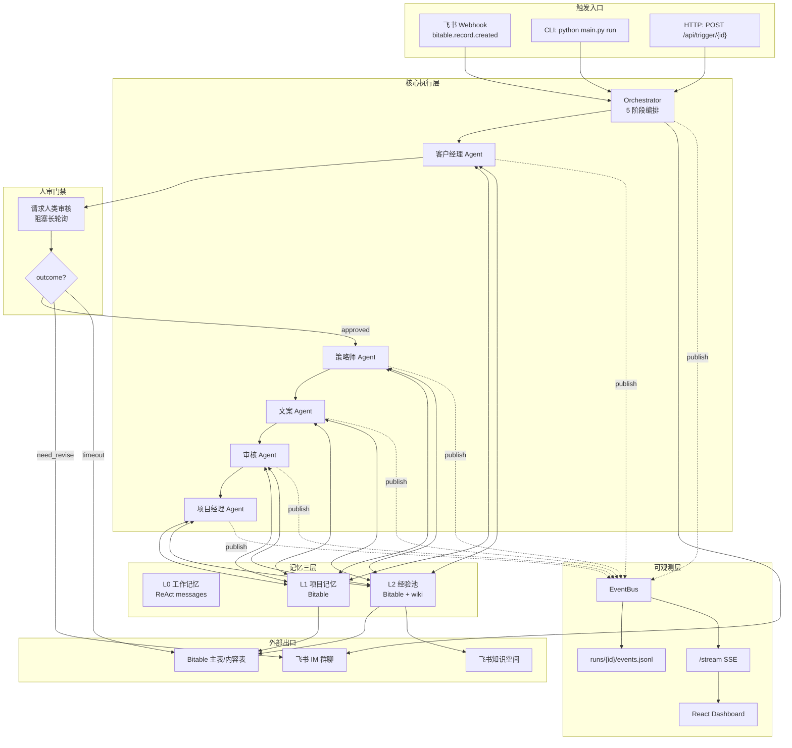

### 1.2 核心组件

| 组件 | 职责 | 主要方法 |
|:---|:---|:---|
| `main.py` | FastAPI 入口 + CLI + webhook + SSE 端点 | `webhook_event` / `trigger_pipeline` / `global_event_stream` |
| `Orchestrator` | 5 阶段串行编排 + 人审门禁 + 审核重试 + 经验沉淀 | `run` / `_run_stage_with_agent` / `_enter_human_review_gate` / `_handle_reviewer_retries` / `_settle_experiences` |
| `BaseAgent` | 唯一 Agent 引擎（soul.md 驱动 ReAct 循环） | `run` / `_llm_call` / `_check_required_tools` / `_hook_reflect` / `_self_write_wiki` |
| `ToolRegistry` | 13 个工具注册 + schema 导出 + dispatch | `call_tool` / `get_tools_for_role` |
| `ProjectMemory` | L1 · 项目主表读写 + 状态机校验 | `load` / `update_status` / `write_*` |
| `ExperienceManager` | L2 · 经验池查询/去重/合并/双写 | `query_top_k` / `check_dedup` / `merge_experiences` / `save_experience` / `save_to_wiki` |
| `EventBus` | 进程内按 record_id 隔离的事件总线 + 磁盘持久化 + 全局订阅 | `publish` / `subscribe` / `subscribe_all` / `load_run` |
| `WikiSyncService` | 后台异步同步线程：本地 wiki → 飞书知识空间 | `start` / `trigger` |
| `BitableClient` | 飞书多维表格 HTTP 封装 | `list_records` / `get_record` / `update_record` / `create_record` / `batch_create` |
| `FeishuIMClient` | 飞书 IM 消息（text / card） | `send_text` / `send_card` / `reply_message` |

### 1.3 执行特点

- **异步优先**：全链路 `async/await`，基于 `asyncio`。FastAPI + httpx + OpenAI SDK async 客户端
- **事件驱动 + 状态机驱动**：Orchestrator 是显式状态机，Agent 内部是 ReAct Think→Act→Observe 循环
- **事件总线双通道**：所有运行时事件既写磁盘（`runs/{id}/events.jsonl`）又推给 SSE 订阅者
- **人机协同门禁**：客户经理阶段结束后阻塞等待人审，超时降级为"待人审"持久状态
- **幂等 & 并发去重**：webhook `_processed_record_ids` + HTTP `_running_record_ids` 两个闸门
- **自进化闭环**：每个 Agent 跑完自动 Hook 蒸馏经验，置信度 ≥ 0.7 双写经验池 + 本地 wiki

---

## 2. 时序图

### 2.1 系统级时序图 · 单次 Webhook 触发到交付

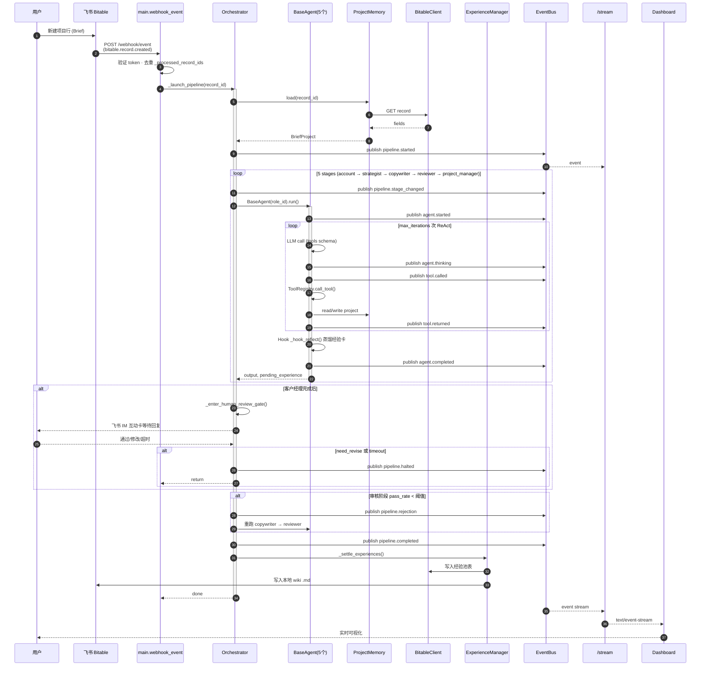

### 2.2 模块级时序图 · Agent ReAct 循环

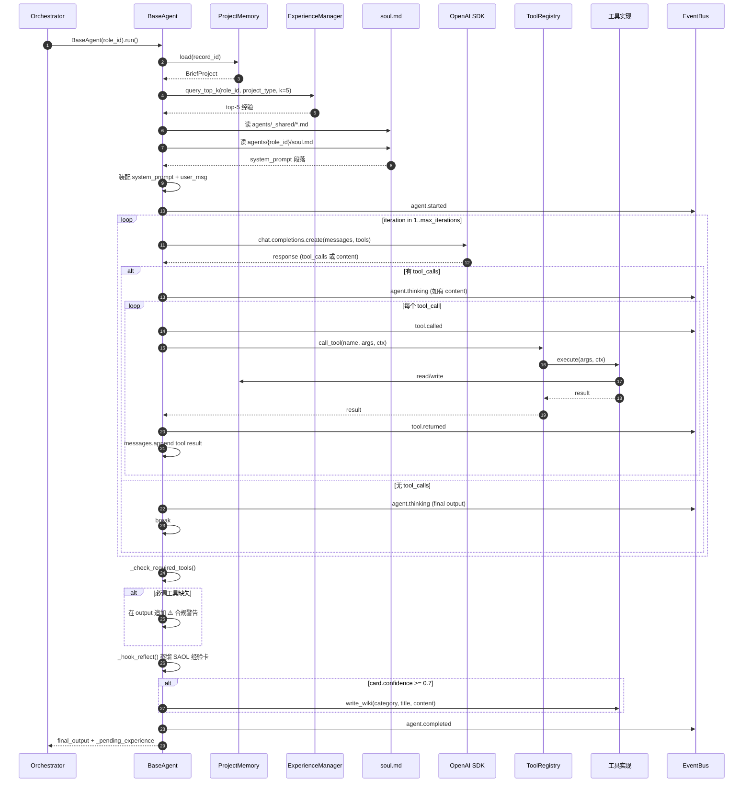

### 2.3 函数级时序图 · Orchestrator.run 核心路径

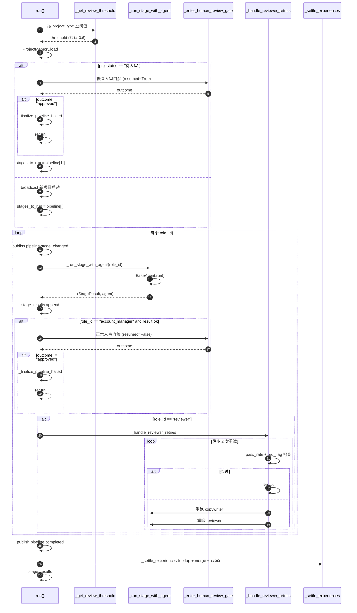

---

## 3. 用户交互流程

### 3.1 触发入口三路

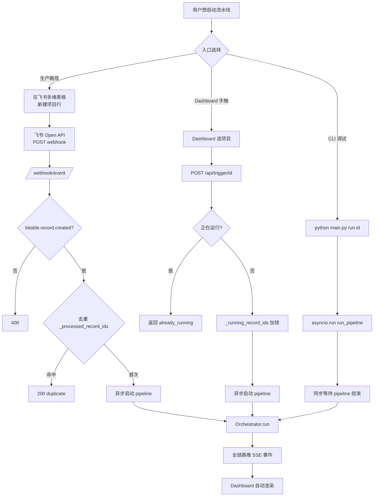

### 3.2 Dashboard 用户交互

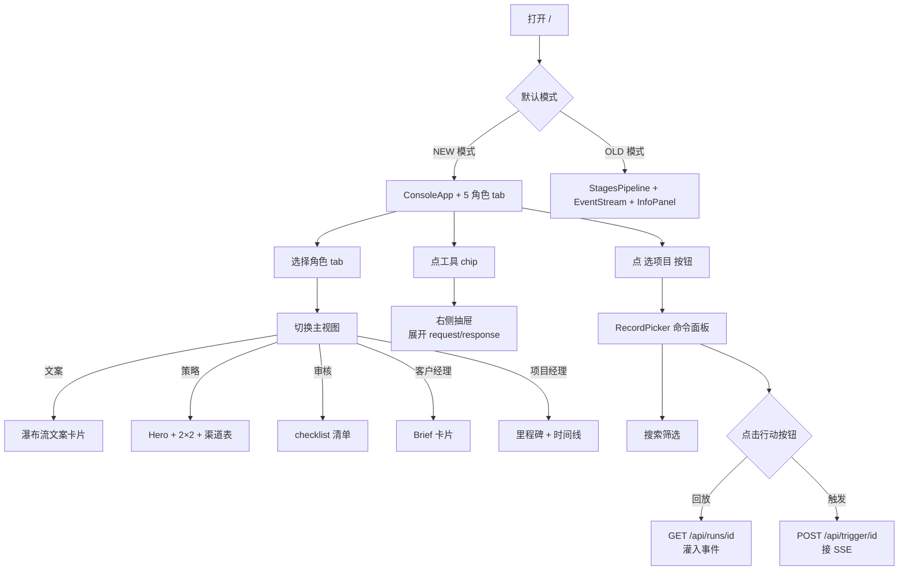

### 3.3 人审门禁交互（IM 互动卡）

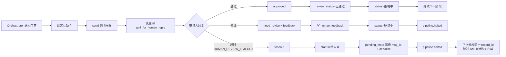

---

## 4. 组件交互流程

### 4.1 组件间通信

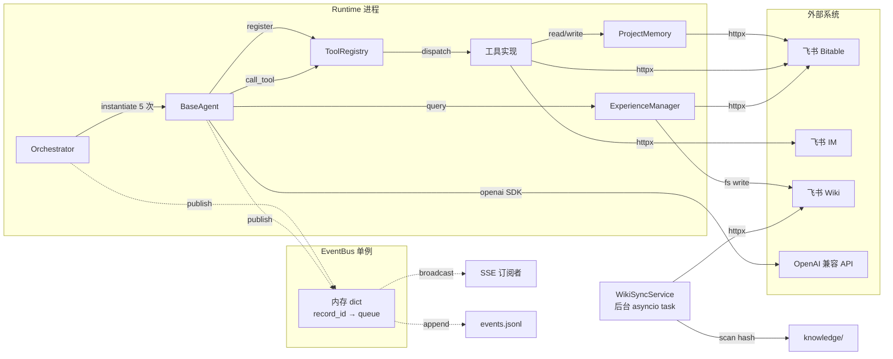

### 4.2 事件流转

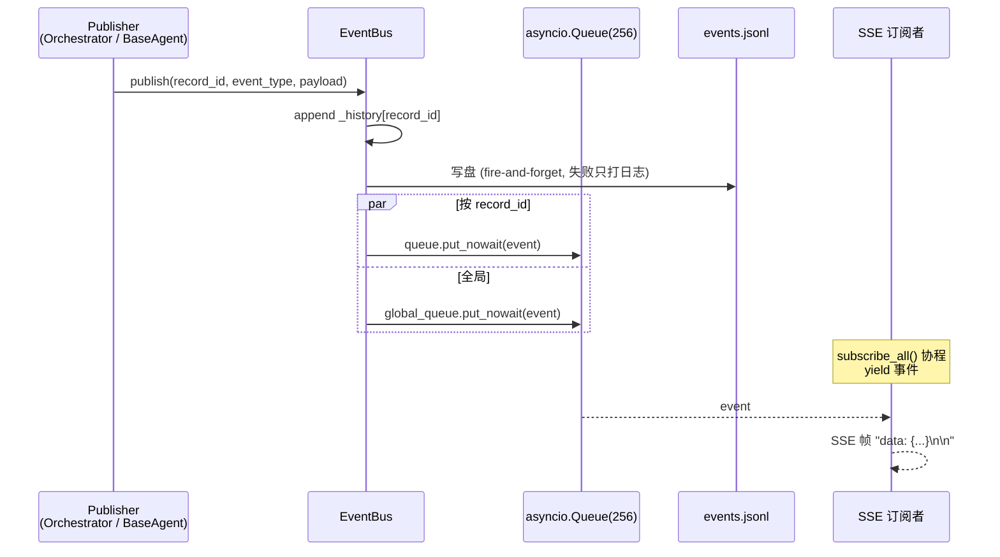

### 4.3 消息传递

- **Agent → Tool**：通过 OpenAI function calling 约定，`tc.function.name` + `tc.function.arguments` 在 JSON 层传值
- **Tool → Bitable**：`BitableClient` 基于 `httpx.AsyncClient`，统一经过 `auth.TokenManager` 拿 tenant_access_token
- **Orchestrator → IM**：`FeishuIMClient.send_card` 发卡片，用于"新项目启动/阶段完成/审核驳回/项目交付"广播
- **Agent 间**：**没有直接通信**，完全通过 Bitable 主表字段作为共享大脑传递（Brief 解读/策略方案/审核总评/交付摘要）

---

## 5. 数据传递流程

### 5.1 整体数据流

```mermaid
flowchart LR
    U[用户 Brief] --> B[Bitable 项目主表<br/>brief_content]
    B --> W[webhook _extract_record_id]
    W --> O[Orchestrator.run]
    O --> PM[ProjectMemory.load<br/>BriefProject]

    PM --> AG[BaseAgent system_prompt<br/>装配上下文]
    AG --> LLM[LLM 生成决策]
    LLM --> TOOL[tool.called arguments]
    TOOL -->|write_project| BITABLE[Bitable 项目主表<br/>brief_analysis / strategy / review_summary / delivery]
    TOOL -->|batch_create_content| CT[Bitable 内容排期表]
    TOOL -->|write_content| CT
    TOOL -->|write_wiki| WIKI[knowledge/wiki/]

    BITABLE -.read back.-> AG
    CT -.read back.-> AG
    WIKI -.search_knowledge.-> AG

    WIKI --> SYNC[WikiSyncService]
    SYNC --> FW[飞书知识空间]

    O -.publish.-> EB[EventBus]
    EB --> JL[events.jsonl]
    EB --> SSE[/stream]
    SSE --> DS[Dashboard SSE 消费]
    DS --> PROJ[fromEvents 投影]
    PROJ --> VIEW[5 角色视图]
```

### 5.2 数据格式转换

#### 表示层 · Bitable 单元格（raw JSON）
```json
{
  "fields": {
    "客户名称": "CDSS",
    "Brief 内容": "六一儿童节促销...",
    "项目类型": "电商大促",
    "状态": "策略中",
    "Brief 解读": [{"text": "# Brief 解读报告\n..."}]
  }
}
```

#### 内部层 · BriefProject (dataclass)
```python
@dataclass
class BriefProject:
    client_name: str
    brief: str
    project_type: str
    status: str
    brief_analysis: str
    strategy: str
    review_summary: str
    review_pass_rate: float
    review_red_flag: str
    review_status: str
    ...
```

#### LLM 视角 · system_prompt 段落
```
[公司共享知识]
{agents/_shared/company.md + sop.md + quality_standards.md}

[角色人格]
{agents/{role_id}/soul.md frontmatter 后的 body}

[项目上下文]
客户: CDSS
项目类型: 电商大促
品牌调性: ...

[历史经验]
1. [置信度 0.85] ...
2. [置信度 0.78] ...
```

#### 事件层 · PipelineEvent
```ts
interface PipelineEvent {
  event_type: string;      // "tool.called" / "agent.completed" 等
  timestamp: number;       // Unix timestamp (seconds)
  record_id: string;
  agent_role: string;      // "copywriter" 等
  agent_name: string;      // "文案" 等
  round: number;           // ReAct 轮次
  payload: Record<string, unknown>;
}
```

#### 前端视图层 · AgentSession（投影产物）
```ts
interface AgentSession {
  client: string; campaign: string; timeline: string;
  roleCounts: Record<RoleId, number>;
  timelineSteps: TimelineStep[];
  toolCalls: ToolCall[];
  account: BriefCard;
  strategy: StrategyDeck;
  copywriter: CopywriterDeck;
  reviewer: ReviewerDeck;
  pm: PMDeck;
  memoryProgress: MemoryProgressItem[];
  auditLog: AuditEntry[];
  toolStats: ToolStat[];
}
```

### 5.3 数据验证

| 层 | 验证点 | 时机 |
|:---|:---|:---|
| webhook 入口 | `WEBHOOK_VERIFICATION_TOKEN` 比对 + `event_type` 白名单 | 请求到达立即校验 |
| 状态机 | `ProjectMemory.update_status` 检查允许流转 | 每次写状态前 |
| 必调工具 | `_check_required_tools` 扫 messages 历史 | ReAct 循环结束后 |
| 审核阈值 | `pass_rate >= threshold AND 无 red_flag` | reviewer 阶段结束 |
| 经验置信度 | `confidence >= 0.7` 才双写落盘 | `_settle_experiences` |
| wiki 同步 | 本地 hash 比对，只推 dirty | `WikiSyncService._scan` |

---

## 6. 状态机设计

### 6.1 项目主表状态机

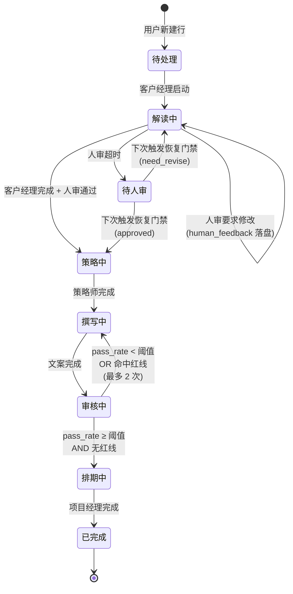

**状态定义：**

| 状态 | 说明 | 进入条件 | 退出条件 |
|:---|:---|:---|:---|
| 待处理 | 用户刚建行，agent 未介入 | webhook / 手触 | AM 启动 |
| 解读中 | 客户经理运行中 | AM `update_status("解读中")` | AM 完成 + 人审通过 |
| 待人审 | 人审超时挂起 | 门禁超时 | 下次触发恢复 |
| 策略中 | 策略师运行中 | 门禁通过 | 策略师完成 |
| 撰写中 | 文案运行中 | 策略师完成或审核驳回 | 文案完成 |
| 审核中 | 审核运行中 | 文案完成 | 通过率判定 |
| 排期中 | 项目经理运行中 | 审核通过 | PM 完成 |
| 已完成 | 全流程交付 | PM 完成 | — |

### 6.2 人审门禁状态机

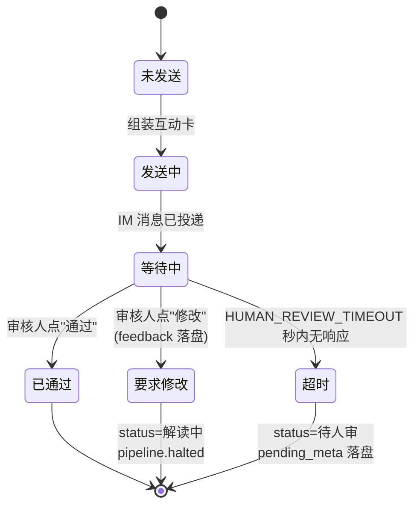

### 6.3 审核返工状态机

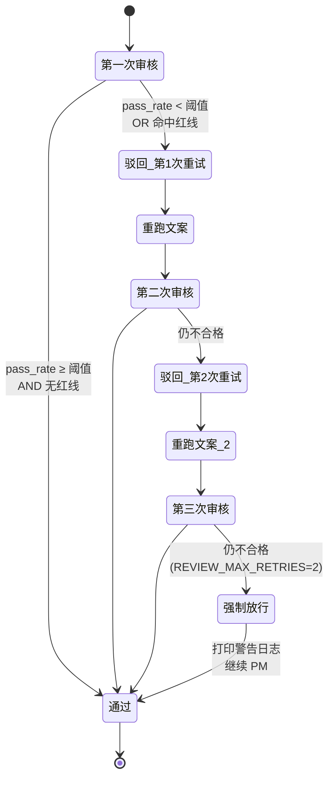

### 6.4 Agent ReAct 循环状态机

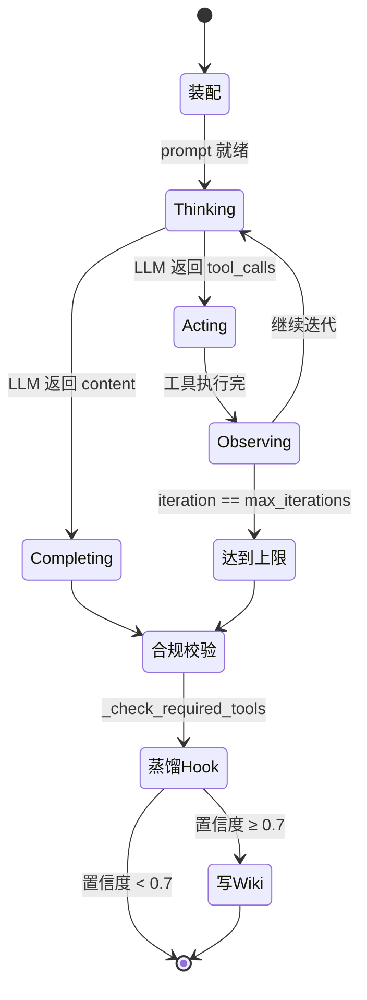

---

## 7. 执行阶段分析

### 阶段 1 · 客户经理（account_manager）

#### 输入
- `record_id` + Bitable 项目主表 `brief_content` / `project_type` / `brand_tone` / `dept_style`
- L2 经验池 top-5 电商大促 Brief 解读经验

#### 处理过程
1. `read_project` 读 brief_content 等字段
2. `search_knowledge` + `read_knowledge` 检索"Brief 解读经验"wiki
3. `update_status("解读中")` 切状态
4. LLM 生成 Brief 解读报告（markdown）
5. `request_human_review(brief_analysis)` 触发人审门禁
6. `write_project(field_name="brief_analysis", content=...)` 落盘
7. `update_status("策略中")` 切状态

#### 输出
- 主表 `brief_analysis` 字段填充
- `review_status = 已通过 / 要求修改 / 超时`
- pending_experience（经验卡片候选）

#### 关键代码
```python
# orchestrator.py: AM 完成后强制进门禁
if role_id == "account_manager" and result.ok:
    gate_outcome = await self._enter_human_review_gate(resumed=False)
    if gate_outcome != "approved":
        await self._finalize_pipeline_halted(project_name, gate_outcome)
        return self.stage_results
```

---

### 阶段 2 · 策略师（strategist）

#### 输入
- 主表 `brief_analysis`（来自 AM）+ `project_type` + `brand_tone` + `dept_style`
- L2 经验池 top-5 对应项目类型的"内容策略模板"

#### 处理过程
1. `read_project` 读 brief_analysis / project_type
2. `search_knowledge` / `search_reference` 检索策略模板和对标案例
3. `write_project(field_name="strategy", ...)` 写策略方案
4. `batch_create_content` 创建内容排期行（seq / title / platform / content_type / key_message / target_audience）
5. `update_status("撰写中")`

#### 输出
- 主表 `strategy` 字段填充
- 内容排期表 N 条新行，每行都有 `record_id`（来自 `tool.returned` 的 record_ids）

---

### 阶段 3 · 文案（copywriter）

#### 输入
- `strategy` + 内容排期表所有行（通过 `list_content`）
- 搜索 / 读取知识库（小红书种草套路、公众号长文结构等）

#### 处理过程
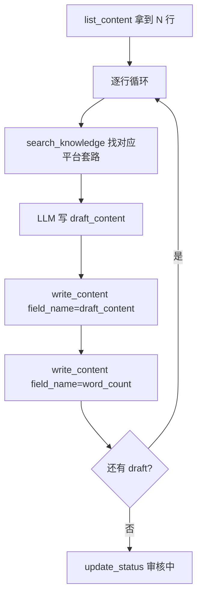

#### 输出
- 每条内容行 `draft_content` + `word_count` 字段填充

---

### 阶段 4 · 审核（reviewer）

#### 输入
- 所有已成稿的内容行（`list_content` + 逐条 `read_project` 获取 draft_content）
- 知识库"品牌合规检查清单"等

#### 处理过程
1. 逐条读 draft_content
2. 调 `search_knowledge` 查合规要点
3. LLM 生成 per-draft verdict
4. `write_content(field_name="review_status", value="approved|need_revise|reject")`
5. `write_project(field_name="review_summary", content=...)`
6. `write_project(field_name="review_pass_rate", content="0.78")`
7. `write_project(field_name="review_red_flag", content="...")`
8. `update_status("排期中")`

#### 关键代码 · 返工触发
```python
# orchestrator.py
if pass_rate >= self._review_threshold and not has_red_flag:
    return
# 否则重跑 copywriter → reviewer，最多 2 次
```

---

### 阶段 5 · 项目经理（project_manager）

#### 输入
- `strategy` + `review_summary` + 所有审核通过的内容行

#### 处理过程
1. `list_content` 拿全量
2. 给每行 `write_content(field_name="计划发布日期", value="YYYY-MM-DD")`
3. `write_project(field_name="delivery", content="交付摘要 markdown")`
4. `send_message` 发终版交付卡到群
5. `update_status("已完成")`

#### 输出
- 内容表每行带计划发布日期
- 主表 `delivery` 字段填充
- 飞书群收到 "项目交付就绪" 卡片

---

## 8. 错误处理

### 8.1 异常类型矩阵

| 异常类型 | 触发条件 | 处理方式 | 影响面 |
|:---|:---|:---|:---|
| `FeishuAPIError` | Bitable / IM / Wiki HTTP 失败 | tenacity 重试 3 次 + 降级日志 | 单次工具调用 |
| LLM 超时 | openai SDK timeout | `LLM_MAX_RETRIES` 次重试 + 指数退避 | 单次 ReAct 迭代 |
| `ToolExecutionError` | 工具内部异常（参数错/API 拒绝） | 捕获后封装为错误字符串返回给 LLM | 继续下一轮 ReAct |
| `json.JSONDecodeError` | LLM 返回的 tool.arguments 不是合法 JSON | 降级为 `{}` 空参调用工具 | 单个工具调用 |
| `StageException` | BaseAgent.run() 整体异常 | StageResult(ok=False) 但 pipeline 继续 | 该阶段产出为空 |
| 人审超时 | `HUMAN_REVIEW_TIMEOUT` 内无回复 | status 落 "待人审"，pipeline.halted | 流程挂起可恢复 |
| `asyncio.CancelledError` | 进程关停 (lifespan shutdown) | `_cancel_all_pipelines` re-raise | 全局优雅退出 |
| webhook token 不匹配 | 401 返回 | 不启动 pipeline | 请求直接拒绝 |
| 同项目并发触发 | `_running_record_ids` 命中 | 返回 `already_running=True` | 软降级不重复 |

### 8.2 错误处理流程

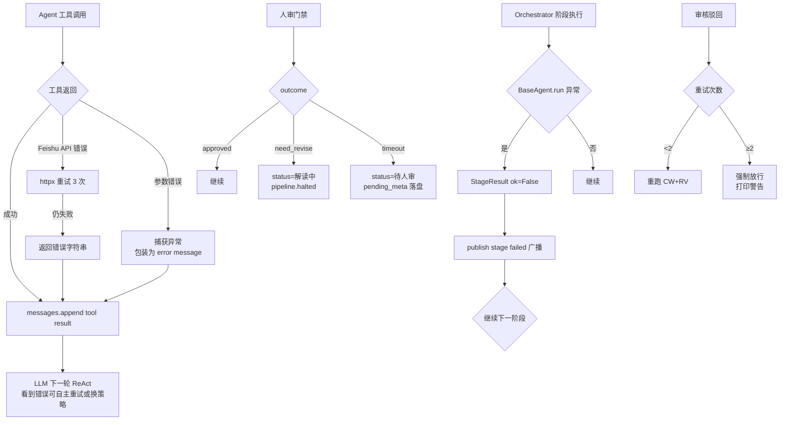

### 8.3 重试策略

| 操作 | 最大重试 | 退避策略 |
|:---|:---|:---|
| LLM API 调用 | `LLM_MAX_RETRIES`（默认 3） | 指数退避 + jitter（openai SDK 默认） |
| Feishu API 调用 | 3 | tenacity `wait_random_exponential(min=1, max=10)` |
| 审核返工 | `REVIEW_MAX_RETRIES`（2） | 无退避，立即重跑 CW→RV |
| Wiki sync | 无次数上限 | 每 `SYNC_INTERVAL` 秒扫描，dirty 文件自动重试 |
| 人审等待 | 无（一次性） | 轮询间隔 `HUMAN_REVIEW_POLL_INTERVAL` |

### 8.4 降级策略

| 服务 | 降级条件 | 降级方案 |
|:---|:---|:---|
| Wiki 同步 | `WIKI_SPACE_ID` 未配置 | 启动时跳过 `_start_background_sync` |
| IM 广播 | `FEISHU_CHAT_ID` 未配置 | `_broadcast` 只打印本地日志 |
| 人审 | `HUMAN_REVIEW_CHAT_ID` 空或 `AUTO_APPROVE=true` | `status="skipped_auto_approve"` 等价通过 |
| EventBus | `event_bus is None` | `BaseAgent._publish` 静默跳过 |
| 经验池 | `_calc_confidence < 0.7` | 不写 Bitable 也不写 wiki，只记日志 |
| Bitable 读取 | `_client.get_record` 抛异常 | 返回默认 `pass_rate=0.5`，不卡死流程 |

### 8.5 错误恢复机制

**人审超时恢复**是核心机制，支持"断点续审"：

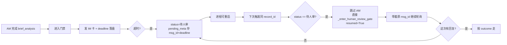

---

## 9. 性能关键路径

### 9.1 性能瓶颈识别

| 路径 | 典型耗时 | 瓶颈点 |
|:---|:---|:---|
| 单次 LLM 调用 | 3-15s | GPT-4 级别模型生成长文（strategy/draft_content） |
| 单次 Bitable 读/写 | 100-300ms | httpx + Feishu API 网络往返 |
| 单个 Agent 完整 ReAct | 60-180s | 3-8 轮 LLM 调用串行 |
| 单次 pipeline 全链路 | 8-20 分钟 | 5 agent 串行 + 可能的审核返工 |
| 人审门禁等待 | 0-HUMAN_REVIEW_TIMEOUT | 人类响应时间主导 |
| Wiki 同步一次 | 几百 ms - 数秒 | dirty 文件数量 × 每文件创建/更新节点 API |
| SSE 事件推送 | <10ms | 内存 queue，瓶颈在网络 |
| Dashboard 事件投影 | <50ms / event | `fromEvents.ts` 聚合 O(N) |

### 9.2 并发拓扑

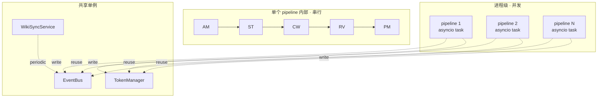

### 9.3 优化建议

- **LLM 并行**：审核阶段可以把每条内容拆成独立 LLM call 并行（目前串行判）
- **事件批量推送**：高频 Agent 场景下 SSE 可合并批发，减少帧数
- **Wiki sync 去抖**：多个 agent 同时写 wiki 时只触发一次同步（已实现 dirty 聚合）
- **Dashboard 投影增量**：`fromEvents.ts` 当前是全量聚合，事件多时可考虑增量 reducer
- **Bitable 批读**：多次 `read_project` 可合并成一次 `list_records` 减少 RTT

---

## 10. 执行监控

### 10.1 关键监控点

| 监控点 | 指标 | 阈值 / 告警 |
|:---|:---|:---|
| pipeline 完成率 | `pipeline.completed` / `pipeline.started` | < 80% 告警 |
| 人审超时率 | `human_review.resolved outcome=timeout` / 总门禁数 | > 30% 提示调整 TIMEOUT |
| 审核驳回率 | `pipeline.rejection` / `pipeline.started` | > 50% 提示 threshold 过高 |
| 单阶段耗时 | `pipeline.stage_changed.prev_duration` | p95 > 300s 告警 |
| LLM 调用失败率 | logger.warning [LLM] | > 5% 告警 |
| 经验沉淀数 | `_settle_experiences` print 输出 | 每日汇总 |
| Wiki 同步失败数 | logger.warning [wiki sync] | > 0 记录 |
| SSE 订阅者数 | `event_bus._global_queues.__len__` | 监控连接泄漏 |

### 10.2 日志记录

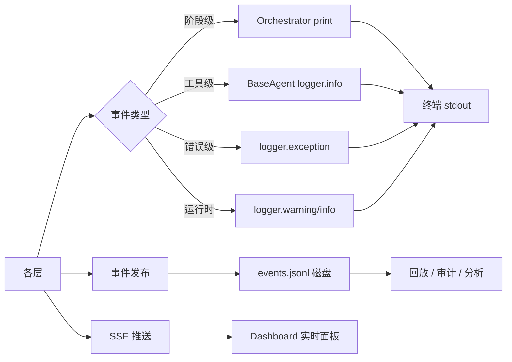

### 10.3 追踪机制

| 追踪字段 | 作用域 | 示例 |
|:---|:---|:---|
| `record_id` | 全链路 | 一个 pipeline 的唯一 id |
| `agent_role` + `agent_name` | 单阶段 | "copywriter" + "文案" |
| `round` | ReAct 循环内 | 工具调用轮次 |
| `timestamp` | 所有事件 | Unix 秒级 |
| `tool_name` | 单次工具调用 | "write_content" |
| `stage_index` + `stage_total` | pipeline 级 | "3/5" |

**完整追踪路径**：Dashboard 点某事件 → drawer 看 request/response → 下钻 `runs/{record_id}/events.jsonl` 定位全上下文。

---

## 附录 A · 事件类型全量清单

| event_type | 来源 | 触发时机 | 关键 payload 字段 |
|:---|:---|:---|:---|
| `pipeline.started` | Orchestrator | `run()` 入口 | project_name / brief / stages / stage_names |
| `pipeline.stage_changed` | Orchestrator | 每阶段进入前 | stage_index / current_role / prev_role / prev_duration |
| `pipeline.rejection` | Orchestrator | 审核驳回时 | pass_rate / attempt / max_attempts |
| `pipeline.halted` | Orchestrator | 门禁中断 | outcome / total_time / project_name |
| `pipeline.completed` | Orchestrator | 全流程结束 | total_time / ok_count / pass_rate / status |
| `agent.started` | BaseAgent | ReAct 前 | project_name / project_type / max_iterations |
| `agent.thinking` | BaseAgent | LLM 返回 content | content |
| `agent.completed` | BaseAgent | ReAct 结束 | output_length |
| `tool.called` | BaseAgent | 每次工具调用前 | tool_name / arguments（未截断） |
| `tool.returned` | BaseAgent | 每次工具调用后 | tool_name / result（截断 300 字） |
| `human_review.started` | Orchestrator | 门禁进入 | resumed |
| `human_review.resolved` | Orchestrator | 门禁结束 | outcome / feedback / resumed |

## 附录 B · 入口 / 出口矩阵

| 入口 | 文件 | 线程模型 |
|:---|:---|:---|
| HTTP webhook | `main.webhook_event` | FastAPI async + `_launch_pipeline` asyncio task |
| HTTP 手触 | `main.trigger_pipeline` | 同上 |
| CLI run | `main.main → run_pipeline` | asyncio.run 单次执行 |
| CLI serve | `main.main` | uvicorn 常驻 |
| CLI sync | `main.run_sync` | 一次性触发 `WikiSyncService.trigger` |

| 出口 | 文件 | 用途 |
|:---|:---|:---|
| Bitable | `feishu/bitable.py` | L1/L2 持久化 |
| IM 消息 | `feishu/im.py` | 广播 + 人审卡 |
| Wiki 节点 | `feishu/wiki.py` | 知识空间人类可读镜像 |
| 事件磁盘 | `runs/{record_id}/events.jsonl` | 执行历史回放 |
| SSE 流 | `/stream` / `/stream/{record_id}` | Dashboard 实时接入 |
| 本地 wiki | `knowledge/wiki/*.md` | Agent 唯一检索源 |

---

> 本文档基于源码（截至 2026-04-18）还原。实际流转以 `orchestrator.py` 和 `agents/base.py` 为准。
