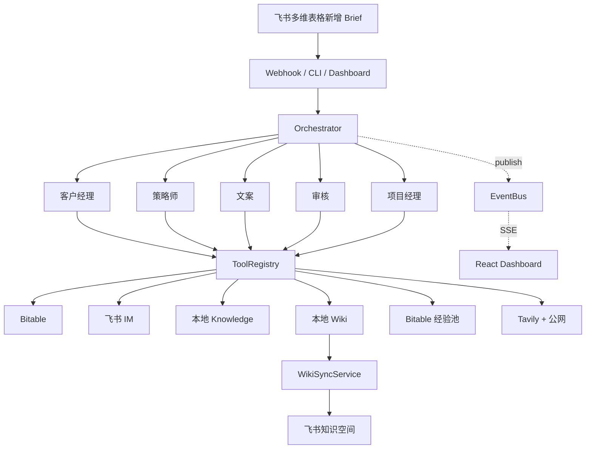
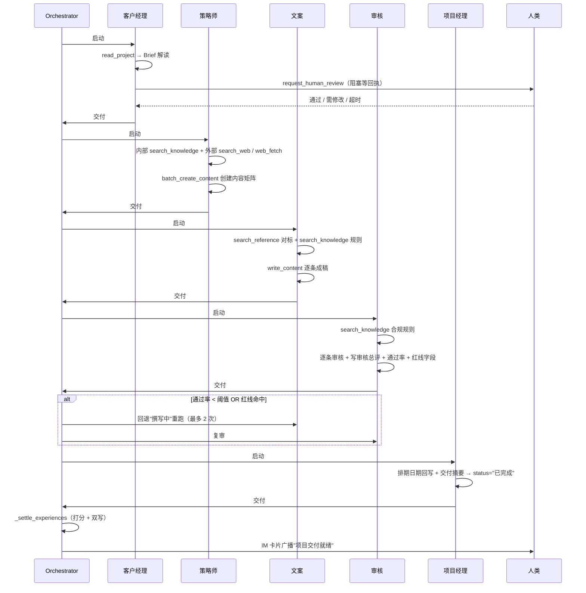

# 飞书·智组织 — 整体架构报告

> 项目：飞书·智组织（虚拟「智策传媒」全案内容营销多智能体系统）
> 版本：2026-04-18 快照
> 范围：后端 Python 12,150 行 · 前端 TS 6,942 行 · 知识库 Markdown 51,188 行

---

## 1. 项目定位

**一句话**：用户在飞书多维表格新建一条 Brief 行，5 个虚拟 Agent（客户经理 → 策略师 → 文案 → 审核 → 项目经理）自动组队，从 Brief 解读到内容交付全链路 5–10 分钟闭环；每跑一次项目就沉淀新经验到本地知识库并异步同步到飞书知识空间。

**核心抓手**：
- **配置驱动 Agent**：新增角色 = 新建目录 + 写一份 `soul.md`，零代码改动
- **本地优先 + 异步同步**：Agent 读本地 `.md`（grep 毫秒级检索），后台线程把变更推到飞书知识空间供人员查看
- **自进化闭环**：Hook 蒸馏 → 置信度打分 → 去重合并 → Bitable + wiki 双存储 → 下次注入

---

## 2. 技术栈与代码规模

| 维度 | 值 |
|---|---|
| Python 后端 | 12,150 行 / 65 文件 |
| TypeScript 前端 | 6,942 行（`dashboard/react-app/`） |
| Markdown 文档/知识 | 51,188 行 |
| 工具总数 | 16 个（function calling schema） |
| Agent 角色 | 5 个 + `_shared` 共享知识 + `contracts` 契约 |
| 多维表格 | 3 张（项目主表 / 内容排期表 / 经验池表） |
| pytest 测试文件 | 20 个 |
| 运维脚本 | 9 个（`scripts/`） |
| 答辩素材 | 7 篇（`docs/presentation/`） |

**选型**：
- Python 3.11+，asyncio 全异步；不使用任何 Agent 框架（langchain/autogen/crewai 都不用）
- LLM 调用走 openai SDK + function calling（OpenAI 兼容接口，支持中转站）
- 飞书交互 httpx 直调 OpenAPI（不走 lark-oapi SDK，payload 可控）
- Web 服务 FastAPI + uvicorn
- 前端 React + TypeScript + Vite + Zustand + SSE
- 知识检索：本地 `.md` + grep 多关键词交集（不用 RAG/向量库）
- 网页抓取：httpx + trafilatura（正文清洗 + Markdown 直出）

---

## 3. 七层架构

```
L7 触发层       飞书多维表格 Webhook / CLI / Dashboard HTTP
L6 编排层       Orchestrator（串行执行 + 驳回重试 + 经验沉淀）
L5 执行层       BaseAgent + 5 份 soul.md（ReAct 循环 + Hook 自省）
L4 工具层       16 个工具（读写表格 / 知识检索 / 联网 / 人审 / IM）
L3 记忆层       L0 Working · L1 Project · L2 Experience（双存储）
L2 持久化层     飞书 Bitable + 飞书 IM + 飞书 Wiki + 本地 .md
L1 异步同步层   WikiSyncService（本地 → 飞书知识空间单向推送）
```

### 3.1 总览流程图（Mermaid）



---

## 4. 目录结构与模块职责

```
feishu-smart-org/
├── main.py                       # FastAPI + CLI 入口（537 行）
├── orchestrator.py               # 编排器（571 行）
├── config.py                     # 全局常量 + env 加载 + 字段映射
├── claude.md / README.md / TODO.md
│
├── agents/
│   ├── base.py                   # 唯一 ReAct 引擎（674 行，配置驱动）
│   ├── _shared/                  # 全员共享知识（company/sop/quality_standards）
│   ├── contracts/                # 角色契约 JSON（输入/输出/工具规约）
│   └── {role}/soul.md            # 人格定义（YAML frontmatter + Markdown body）
│
├── tools/                        # 16 个工具
│   ├── __init__.py               # ToolRegistry 自动扫描 .py 注册
│   ├── read_project / write_project / update_status
│   ├── list_content / create_content / batch_create_content / write_content
│   ├── search_knowledge / read_knowledge / write_wiki
│   ├── search_reference          # 爆款对标（文案专用）
│   ├── search_web / web_fetch    # 外部情报（策略师专用）
│   ├── get_experience            # L2 经验池查询
│   ├── send_message              # 飞书 IM 广播
│   └── request_human_review      # 人审阻塞
│
├── memory/
│   ├── working.py                # L0: 对话窗口 + token 估算
│   ├── project.py                # L1: BriefProject/ContentItem/ContentRecord
│   └── experience.py             # L2: 双存储 + 去重 + 合并 + 质量门禁
│
├── feishu/                       # 飞书 OpenAPI 封装
│   ├── auth.py                   # TokenManager 单例缓存
│   ├── bitable.py                # 多维表格 CRUD + rich_text_to_str 归一
│   ├── im.py                     # IM 卡片消息
│   └── wiki.py                   # 知识空间节点/文档 API（仅 sync 层调用）
│
├── sync/
│   └── wiki_sync.py              # 后台异步同步服务（234 行）
│
├── knowledge/                    # 知识库
│   ├── raw/                      # 人工上传历史方案（只读）
│   ├── references/               # 平台规则 / 爆款库
│   ├── wiki/                     # Agent 自动蒸馏（按项目类型分目录）
│   ├── 01_企业底座/ ... 11_待整理/  # 人工维护的企业知识分类（15+ 目录）
│   ├── _index.md                 # wiki 索引（write_wiki 自动更新）
│   └── .sync_state.json          # 文件 hash + synced_at 状态
│
├── dashboard/
│   ├── event_bus.py              # 内存 pub/sub + 磁盘持久化
│   ├── react-app/                # Vite + React 前端源码（27 个 tsx）
│   └── static/                   # 构建产物（index.html + chunks）
│
├── demo/                         # 3 个预置 Brief + run_demo.py
├── docs/                         # 架构文档 + 答辩素材
├── scripts/                      # 运维/诊断脚本
└── tests/                        # pytest 测试
```

---

## 5. 核心数据流（端到端闭环）

### 5.1 触发与编排

```
[飞书多维表格新增 Brief 行]
         │
         ▼ (event: bitable.record.created_v1)
[main.py /webhook/event]
   ├── 幂等去重 (_processed_record_ids)
   └── asyncio.create_task(_launch_pipeline)
         │
         ▼
[Orchestrator.run()]
```

### 5.2 五阶段流水线



### 5.3 经验沉淀

```
每个 Agent 跑完 → Hook 自省 → 经验卡（SAOL JSON）
  │
  ▼
Agent._self_write_wiki → 本地 knowledge/wiki/{category}/{role_id}_{...}.md
  │
  ▼
Orchestrator._settle_experiences
  ├── 置信度打分 = 0.4×pass_rate + 0.3×完成 + 0.2×无返工 + 0.1×引用知识
  ├── < 0.7 → 丢弃
  ├── ≥ 0.7 → ExperienceManager.save_experience（Bitable 经验池）
  └── 同时 save_to_wiki（若 Agent 未自主写）
  │
  ▼
WikiSyncService 后台扫描 .sync_state.json → dirty 文件 → 推飞书知识空间
```

---

## 6. 三层记忆架构

| 层 | 位置 | 生命周期 | 载体 | 关键实现 |
|---|---|---|---|---|
| **L0 Working** | `memory/working.py` | 任务结束销毁 | 进程内 | `MessageWindow` 滑动窗口 + `estimate_tokens` 粗估 |
| **L1 Project** | `memory/project.py` | 项目粒度 | 飞书 Bitable | `BriefProject`(17 字段) + `ContentItem/Record`；字段名用 `FIELD_MAP_*` 中英映射 |
| **L2 Experience** | `memory/experience.py` | 跨项目永久 | Bitable 经验池表 + 本地 `knowledge/wiki/*.md` 双写 | SAOL 结构 · 按 `role::category::lesson` 指纹去重 · 每类上限 3 条触发 LLM 合并 · 质量门禁（字段长度校验） |

**双存储的底层逻辑**：
- Bitable 经验池：结构化查询（按角色+场景 top-K 注入 prompt）
- 本地 wiki：全文检索（Agent 跑 `search_knowledge` 可直接命中）

---

## 7. Agent 引擎核心机制（`agents/base.py` 674 行）

| 机制 | 实现 |
|---|---|
| **soul.md 解析** | 手写 60 行 YAML frontmatter 解析器，不依赖 PyYAML |
| **共享知识拼接** | `load_shared_knowledge()` 自动拼 `agents/_shared/*.md` |
| **经验注入** | `_load_experiences()` 按 `project_type` 查 L2 top-K |
| **prompt 装配** | 共享知识 → soul body → 项目上下文 → 历史经验 |
| **工具过滤** | 按 `soul.tools` 声明从 `ToolRegistry` 过滤后注册给 LLM |
| **ReAct 循环** | 最多 `max_iterations` 轮 Think→Act→Observe；LLM 无工具调用时结束 |
| **代码级硬约束** | `_REQUIRED_TOOL_CALLS` 校验必调工具（AM 必调 `request_human_review`，文案必调 `search_reference + search_knowledge`，审核必调 `search_knowledge`） |
| **事件广播** | `_publish()` 发 `agent.started/thinking/completed · tool.called/returned` |
| **Hook 自省** | 角色专属 `_REFLECT_PROMPT`（AM/文案/审核定制） |
| **自主 wiki 写入** | `_self_write_wiki()` 用 `{role_id}_{前20字}_{md5前8位}` 命名去重 |

---

## 8. 工具系统（`tools/` 16 个）

| 工具 | 用途 | 主要调用方 |
|---|---|---|
| `read_project` / `write_project` / `update_status` | 项目主表 CRUD + 状态机 | 全员 |
| `list_content` / `create_content` / `batch_create_content` / `write_content` | 内容排期表 CRUD | 策略师/文案 |
| `search_knowledge` / `read_knowledge` | 本地知识库检索 | 全员 |
| `write_wiki` | 经验蒸馏写入本地 wiki | Hook 自省阶段 |
| `search_reference` | 爆款对标（按平台+关键词 grep `references/`） | 文案 |
| `search_web` | Tavily 联网搜索（AI 摘要 + URL 列表） | 策略师 |
| `web_fetch` | 抓取指定 URL 正文（trafilatura + SSRF 防护） | 策略师 |
| `get_experience` | L2 经验池查询（去重参考） | Hook 前置校验 |
| `send_message` | 飞书 IM 群卡片广播 | 编排器 + 角色通知 |
| `request_human_review` | 阻塞等待人类回执 | 客户经理 |

**统一协议**：每个工具文件导出 `SCHEMA`（OpenAI function calling JSON schema）+ `async def execute(params, context) -> str`。`ToolRegistry` 启动时自动扫描 `tools/` 目录注册。

---

## 9. 事件系统与可观测性

```
Agent / Orchestrator ──publish──▶ EventBus (dashboard/event_bus.py)
                                     │
                                     ├── 内存 pub/sub（多订阅者并发）
                                     ├── 磁盘持久化 runs/<record_id>.jsonl
                                     └── API
                                         ├── GET  /api/pipelines
                                         ├── GET  /api/runs · /api/runs/<rid>
                                         ├── GET  /stream（全局 SSE）
                                         ├── GET  /stream/<rid>（单项目 SSE）
                                         ├── POST /api/trigger/<rid>
                                         └── POST /api/demo/start
                                                │
                                                ▼
                                         [React Dashboard]
                                           · 5 个角色 View（Account/Strategy/Copy/Review/PM）
                                           · ToolChipRow / ToolDrawer
                                           · TimelineStrip / PlanPrimitives
                                           · RecordPicker 命令面板
```

**关键事件类型**：
- Pipeline 级：`pipeline.started / pipeline.stage_changed / pipeline.rejection / pipeline.completed`
- Agent 级：`agent.started / agent.thinking / agent.completed`
- Tool 级：`tool.called / tool.returned`

---

## 10. 状态机

```
项目主表 "状态" 字段流转（config.py VALID_STATUSES）

   待处理 → 解读中 → 策略中 → 撰写中 → 审核中 → 排期中 → 已完成
               │                  ▲         │
               │                  │         ▼
            (人审门禁)         [驳回]    通过 / 需修改 / 超时
            待人审                 └─ 通过率 < 阈值 或 红线命中
               │                     → 回退"撰写中"（最多 2 次）
               ├─ 通过 → 进入策略中
               └─ 需修改 → 重回解读中
```

**审核阈值**（`config.REVIEW_THRESHOLDS_BY_PROJECT_TYPE`）：
- 电商大促 / 日常运营 = 0.6
- 新品发布 / 品牌传播 = 0.7
- 母婴 = 0.8
- 医疗健康 = 0.9

---

## 11. 扩展点 — 最小颗粒度清单

| 场景 | 改动面 |
|---|---|
| 加一个 Agent | 新建 `agents/{new_role}/soul.md`；在 `orchestrator.py` 的 `self.pipeline` 插入；如需硬约束加 `_REQUIRED_TOOL_CALLS` |
| 加一个工具 | 新建 `tools/{new_tool}.py`，导出 `SCHEMA` + `async def execute()`；`ToolRegistry` 自动发现；在相关 soul.md 的 `tools:` 列表加名字 |
| 加一张多维表 | `config.py` 加 `NEW_TABLE_ID` + `FIELD_MAP_NEW`；在 memory 层加语义封装 |
| 加一种事件 | Agent/Orchestrator 里 `self._publish("new.event", payload)`；前端订阅新增处理 |
| 改审核策略 | `REVIEW_THRESHOLDS_BY_PROJECT_TYPE` 加一项，或 `REVIEW_RED_FLAG_KEYWORDS` 加关键词 |
| 换 LLM 模型 | 只改 `.env` 的 `LLM_BASE_URL / LLM_API_KEY / LLM_MODEL`，OpenAI 兼容接口即插即用 |

---

## 12. 已识别的架构风险 / 技术债

| # | 风险 | 位置 | 严重度 |
|---|---|---|---|
| 1 | 策略师 / PM **无代码级必调工具**，全靠 prompt 纪律 | `base.py:124-130` `_REQUIRED_TOOL_CALLS` | 中 |
| 2 | ReAct **无全局 token 窗口保护**，超长项目理论上可打爆 L0 | `base.py:325` 仅靠 `max_iterations` 间接控制 | 中 |
| 3 | 飞书富文本字段可能返回数组或字符串，`bitable.py` 每处都要 `rich_text_to_str` | 散落调用 | 低 |
| 4 | Webhook 幂等只在内存 `_processed_record_ids`，重启后同 record 可能重跑 | `main.py:22` | 中（demo 可接受） |
| 5 | sync 单向推送，人在飞书知识空间编辑不会回流 | `sync/wiki_sync.py` 设计决策 | 有意为之 |
| 6 | `knowledge/` 下人工分类目录（01–11）与 `wiki/` Agent 蒸馏两套结构并存 | 架构二元性 | 中 |
| 7 | Hook 自省 JSON 解析失败 → 本次经验丢失（静默跳过） | `base.py:518-520` | 低 |

---

## 13. 亮点（答辩主材料）

1. **配置驱动 + 零框架**：674 行 `base.py` 撑起 5 个 Agent，新角色 2 分钟接入
2. **三层记忆 + 双存储**：L2 Bitable（结构化查询）+ 本地 wiki（全文检索），各取所长
3. **知识双轨制**：Agent 读本地（grep 毫秒级）、人员看飞书（单向异步推送）
4. **自进化闭环**：Hook 蒸馏 → 置信度打分 → 去重合并 → 双写 → 下次注入
5. **多维度观察**：EventBus + SSE + React Dashboard 全链路可回放
6. **人机协同**：`request_human_review` 阻塞等待，断点续审语义完整
7. **代码级兜底**：`_REQUIRED_TOOL_CALLS` + `_ensure_account_manager_human_review` 防 prompt 偏航
8. **策略师联网调研**：Tavily 搜索 + trafilatura 正文抽取 + SSRF 防护，外部情报链路闭环

---

## 14. 项目成熟度总评

| 维度 | 评分 | 说明 |
|---|---|---|
| 架构清晰度 | 9/10 | 7 层分明、职责单一 |
| 代码一致性 | 9/10 | 工具 / Agent / Memory 范式统一 |
| 可扩展性 | 9/10 | 配置驱动，新增改动面极小 |
| 可观测性 | 8/10 | EventBus + Dashboard 完整 |
| 自进化能力 | 8/10 | Hook + 双存储 + 去重合并 |
| 健壮性 | 7/10 | 有 7 项已识别技术债 |
| 测试覆盖 | 7/10 | 20 个 pytest 文件，覆盖核心 |
| 文档完备度 | 9/10 | `docs/presentation/` 答辩齐备 |
| **综合** | **8.2/10** | 答辩级工程品质 |

---

## 附录 A — 关键配置清单

`.env` 必填项：
- `FEISHU_APP_ID / FEISHU_APP_SECRET`
- `BITABLE_APP_TOKEN / PROJECT_TABLE_ID / CONTENT_TABLE_ID / EXPERIENCE_TABLE_ID`
- `LLM_BASE_URL / LLM_API_KEY / LLM_MODEL`

`.env` 可选：
- `FEISHU_CHAT_ID`（IM 广播）
- `WIKI_SPACE_ID`（知识空间同步）
- `WEBHOOK_VERIFICATION_TOKEN`
- `TAVILY_API_KEY`（策略师联网搜索）
- `AUTO_APPROVE_HUMAN_REVIEW`（demo 快速跑通时设 true）

## 附录 B — 入口命令

```bash
python main.py run <record_id>   # CLI 跑一次流水线
python main.py sync              # 手动触发一次 wiki 同步
python main.py serve             # 启动 FastAPI webhook 服务
python demo/run_demo.py --scene 电商大促    # 预置 demo
python scripts/test_web_tools.py all         # 搜索/抓取工具全套测试
```

Webhook 地址：`POST /webhook/event`
Dashboard 地址：`GET /dashboard`
