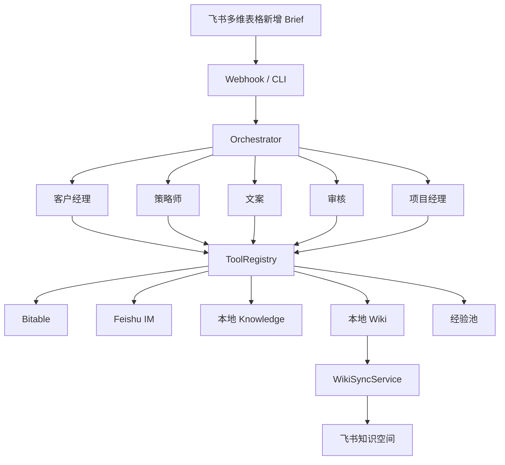

# 系统架构图

## 架构口径

系统由 5 层组成：

1. **触发层**：飞书多维表格 / Webhook / CLI
2. **编排层**：Orchestrator
3. **执行层**：5 个角色 Agent
4. **工具层**：Bitable / IM / Wiki / Knowledge / Experience 工具
5. **记忆层**：L0 工作记忆、L1 项目记忆、L2 经验池

## Mermaid 图

## 讲解重点

- **触发即启动**：用户不需要懂 Agent，只需要填 Brief
- **编排统一控制**：所有角色执行顺序、重试、广播都由 Orchestrator 管
- **知识双轨制**：Agent 读本地知识，人员看飞书知识空间
