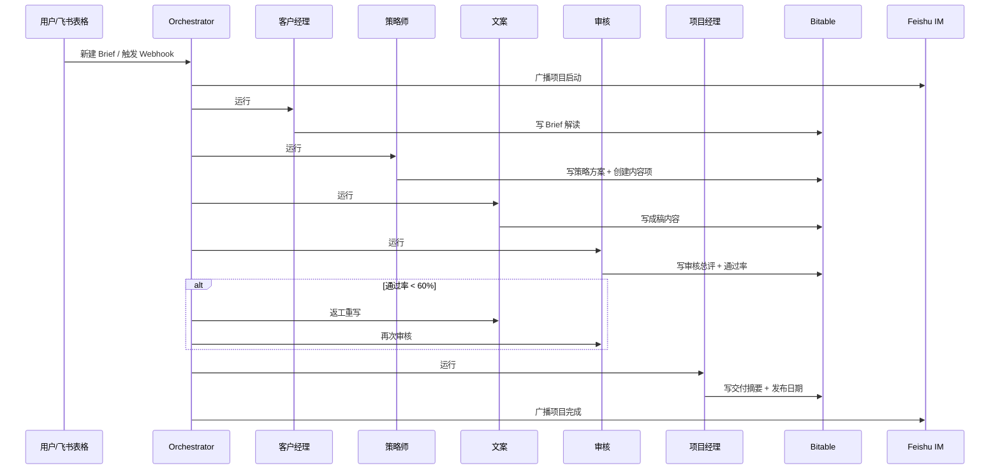

# 流水线时序图

## 执行顺序

1. 客户经理：解读 Brief，判断是否准入
2. 策略师：产出内容策略，拆解内容任务
3. 文案：逐条生成草稿
4. 审核：评分、反馈、决定是否返工
5. 项目经理：生成交付摘要，安排发布日期

## Mermaid 图

```mermaid
sequenceDiagram
    participant U as 用户/飞书表格
    participant O as Orchestrator
    participant AM as 客户经理
    participant ST as 策略师
    participant CW as 文案
    participant RV as 审核
    participant PM as 项目经理
    participant BT as Bitable
    participant IM as Feishu IM

    U->>O: 新建 Brief / 触发 Webhook
    O->>IM: 广播项目启动
    O->>AM: 运行
    AM->>BT: 写 Brief 解读
    O->>ST: 运行
    ST->>BT: 写策略方案 + 创建内容项
    O->>CW: 运行
    CW->>BT: 写成稿内容
    O->>RV: 运行
    RV->>BT: 写审核总评 + 通过率
    alt 通过率 < 60%
        O->>CW: 返工重写
        O->>RV: 再次审核
    end
    O->>PM: 运行
    PM->>BT: 写交付摘要 + 发布日期
    O->>IM: 广播项目完成
```

## 讲解重点

- 不只是单 Agent 输出，而是**角色化协作链路**
- 审核环节有**返工闭环**，不是一把梭
