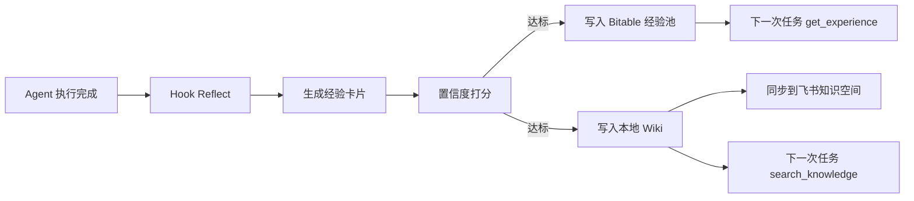

# 自进化闭环

## 闭环流程

1. Agent 完成任务
2. Hook 回看执行过程
3. 蒸馏一张 SAOL 经验卡片
4. 计算置信度
5. 达标后写入经验池 + 本地 Wiki
6. 下次同类项目启动时注入经验

## Mermaid 图

## 讲解重点

- 项目不是静态 Agent 编排，而是**带学习能力的工作流**
- 经验沉淀不是单纯日志，而是经过结构化提炼与置信度筛选
